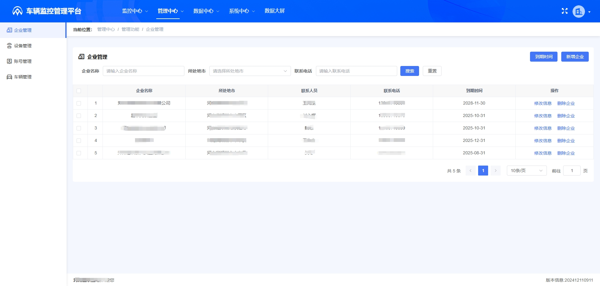
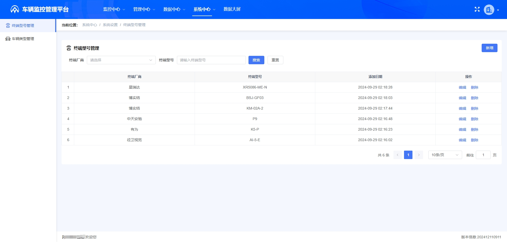
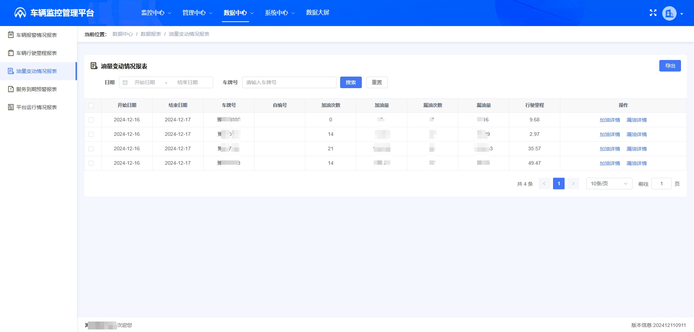

# 车辆动态监控系统(jt808/jt1078)

#### 介绍

1. 北斗安心联车辆动态定位监控系统是基于北斗/GPS和其他无线通信技术，对车辆进行实时定位监控和视频监控的管理服务。系统支持JT/T808, JT/T809, JT/T1077, JT/T1078, T/JSATL11-2017, T/JSATL12-2017等技术协议。用于实时采集车辆位置、速度、方向、视频等信息，并通过通信网络传输至监控平台。平台负责接收、处理和存储车辆数据，提供实时的车辆监控、调度、报警等功能。
2. 4核16G的基础配置，支撑10万并发（808基础数据+传感器数据）。
3. 平台覆盖校车、餐车、泵车、公务车、私家车、渣土车、环卫车、公交车、出租车、分期车、租赁车、冷链运输车、水泥搅拌车、物流运输车、油品运输车、景区摆渡车等多种车型，提供全面的位置监控、视频监控、车队管理、报警监控和数据分析服务。
4. 支持对接视频、油耗、载重、温度、滚筒、门磁等多种硬件传感器，实现车辆状态的全方位监控，让数据驱动决策。
   

#### 技术栈

```
后端/分析端：
    技术栈：jdk1.8、Springboot2、MySQL8、Redis、Kafka、Mongodb
电脑端：
    技术栈：vue3、typeScript3、vite2、elementPlus
手机端：
    技术栈：uniapp
协议端(808/1078)：Netty4、Springboot2
```

#### 安装教程

##### 后端/协议端/分析端

1.安装jdk1.8，MySQL数据库，Redis缓存数据库，Mongodb数据库，搭建协议服务器，搭建后端服务器，maven依赖管理。

2.修改各个模块的yml配置文件，包括MySQL、Redis、Mongodb连接信息，创建日志打印文件夹。

3.协议端、后端、分析端提供一键启动脚本


##### 电脑端

SaaS模式管理各账号，有管理端、运营端和企业端

1.安装node

2.依赖安装：npm install 

3.运行：npm run dev 

4.打包：npm run build


##### 移动端

使用uniapp开发，上手很快，支持生成安卓、苹果、小程序，都已全部上架运行


##### 功能列表


管理端：上架协议管理、APP更新管理、运营商管理。

运营端：实时定位、实时视频、轨迹回放、视频回放、企业管理、设备管理、账号管理、车辆管理、车辆报警情况报表、车辆行驶里程报表、油量变动情况报表、服务到期预警报表、平台运行情况报表、车辆超速报警记录、设备离线报警记录、违规卸料报警记录、非法驶入报警记录、非法驶出报警记录、温度异常报警记录、主动安全报警记录、终端型号管理、车辆类型管理和数据大屏。

企业端：实时定位、实时视频、轨迹回放、视频回放、车辆管理、围栏管理、标注管理、车辆超速报警设置、温度异常报警设置、违规卸料报警设置、非法驶入报警设置、非法驶出报警设置、主动安全报警设置、车辆报警情况报表、车辆行驶里程报表、油量变动情况报表、车辆超速报警记录、设备离线报警记录、违规卸料报警记录、非法驶入报警记录、非法驶出报警记录、温度异常报警记录、主动安全报警记录和数据大屏。

#### 系统截图

##### 管理员端：


##### 运营端：








##### 用户端





#### 联系方式

```
 支持独立部署，支持源码出售，支持功能定制化开发，加微细聊
```

